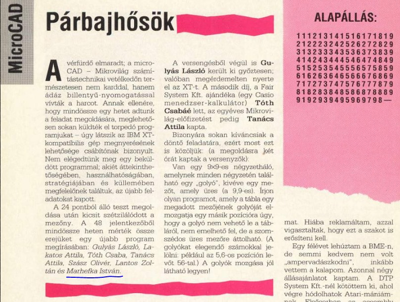

A Mikrovilág magazinban meghirdetett programozói verseny döntőjének feladat megoldása (1991. április)
=====================================================================================================

Van egy 9x9-es négyzetháló, amelynek minden négyzetén található egy "golyó", kivéve egy mezőt, amely üres (a 9,9-es). 

Írjon olyan programot, amely a tábla egy megadott mezőjének golyóját elmozgatja egy másik pozícióra úgy, hogy a golyó nem 
vehető le a tábláról, nem emelhető fel, de a szomszédos üres mezőre áttolható. (A golyókat elegendő számokkal jelölni: például 
az 5,6-os pozícion levőt 56-tal.) A golyók mozgása jól látható legyen!

Köszönet Fehér Péternek a régi Mikrovilág szám beszkennéléséért :)

